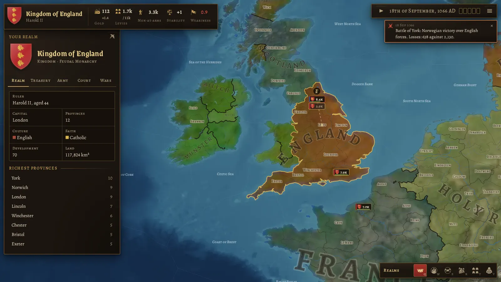
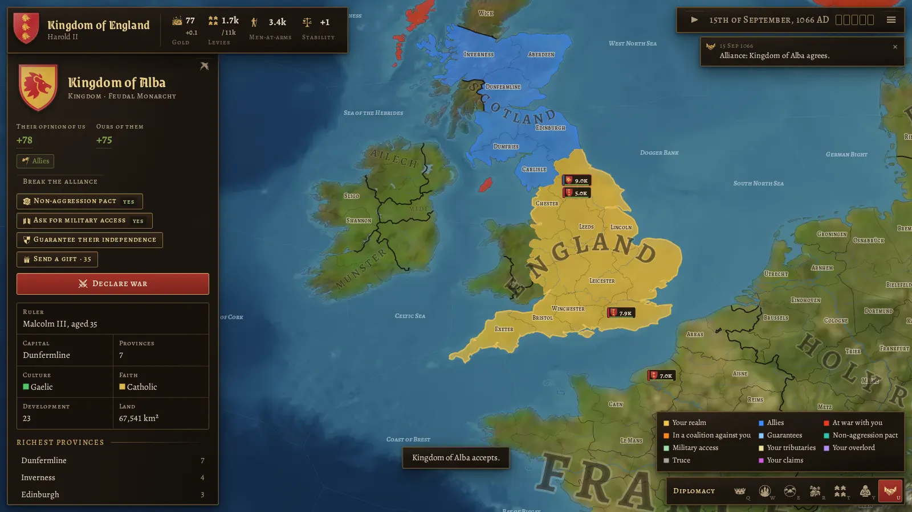
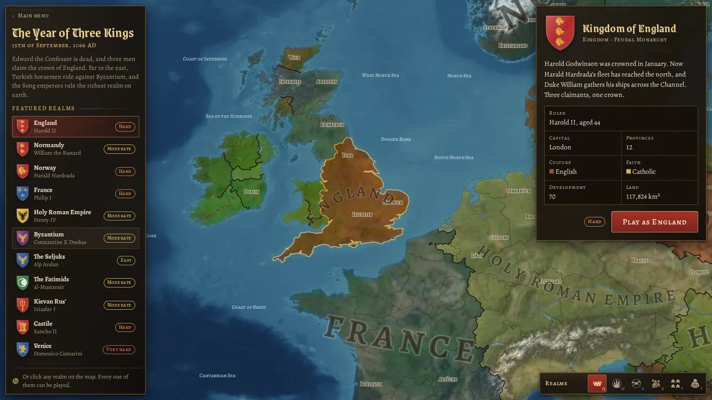

# Crowns & Centuries

A grand strategy game in the spirit of Crusader Kings, played in the browser on a map of the whole
world. You rule a **country**, not a dynasty: pick any of the 188 realms of 15 September 1066, and
(in later milestones) guide it through a thousand years of war, diplomacy, faith and invention until
1 January 2066.

**Play in the browser:** https://danyalkhan95.github.io/Crusader-Kings-Clone/ (GitHub Pages, rebuilt on
every push).



## Status

**Milestone 2: diplomacy.** Realms make friends and enemies. Every other realm is run by the AI.

- **Opinion:** every realm has a view of every other, with the reasons on hover: faith and culture,
  treaties, claims, wars, gifts, betrayals, and fear of your conquests.
- **Treaties:**
  - alliances (allies answer calls to arms, or the alliance breaks)
  - non-aggression pacts
  - military access (armies may only march through land they have leave to enter)
  - guarantees of independence
  - the AI weighs every proposal with the same breakdown you see before you send it
- **Claims:** your chancellor forges claims on land across your border. A claim is a just cause
  for war and halves the land's price at the peace table. War without a claim costs stability.
- **Aggressive expansion and coalitions:** conquests alarm the neighbours. Those who fear you band
  together, and strike once they are strong enough.
- **Subjects:** vassal loyalty, integration of loyal vassals, tributaries (won at the peace table),
  and wars of independence.
- **Wars with allies:** calls to arms for allies, guarantors, overlords and coalition members;
  separate peace for those who are not leading a side.
- **The diplomacy map** (`U`) shows your allies, enemies, pacts, subjects and claims.



From milestone 1:

- **Time:** real time with pause and five speeds, from a day a second to four months a second.
  Wars declared on you, lost battles, offers and an empty treasury pause the game.
- **Economy:** taxes and levies from development, stability, war weariness and the council; six
  buildings in three levels; a monthly budget with breakdowns, loans and bankruptcy.
- **Characters:** a ruler, an heir and a council of five, with skills and traits. They age and
  die; the heir succeeds.
- **Armies, battles and sieges:** levies and six kinds of men-at-arms, marching by the fastest
  allowed route over land and sea, supply and attrition; terrain, river crossings, unit counters,
  commanders, morale, pursuit; forts, siege engines and occupation.
- **War and peace:** war score from battles, occupation and the war goal; peace deals that cede
  provinces, pay gold, take a crown or make the loser pay tribute; truces afterwards.
- **1066:** Harald Hardrada lands at York with Tostig, and William of Normandy sails for England
  two weeks later.
- **Saves:** save and load in the browser, plus export and import as a file.

From milestone 0:

- **The map:**
  - 3,000 land provinces, 498 sea zones and 35 great lakes.
  - Hillshaded terrain with rivers.
  - Borders styled by realm, vassal and province.
  - Curved realm names.
- **Map modes:** realms, countries, terrain, development, culture and faith.
- **The world of 1066:**
  - 188 realms, with lieges and vassals and 1066 rulers.
  - Cultures and faiths for every province.
  - A coat of arms for every realm: curated for the major ones, generated for the rest.
- **Look:** a medieval theme. The UI changes with the era in later milestones.



Next up is **Milestone 3: internal politics**, with government types, laws, estates, factions and
civil wars. The full plan is in [docs/ROADMAP.md](docs/ROADMAP.md).

## Controls

| Action            | Mouse / touch                            | Keys                        |
| ----------------- | ---------------------------------------- | --------------------------- |
| Pan               | drag                                     | arrow keys                  |
| Zoom              | wheel, pinch, double-click               | `+` / `-`                   |
| Inspect, treat    | click a province, army or coat of arms   |                             |
| March             | select an army, then right-click a place |                             |
| Pause, speed      | buttons at the top right                 | `Space`, `1`–`5`            |
| Map modes         | buttons at the bottom right              | `Q` `W` `E` `R` `T` `Y` `U` |
| Close panel, menu |                                          | `Esc`                       |

## Running it

```sh
npm install
npm run dev        # http://localhost:5173
npm run build      # static site in dist/, works from any folder or host
```

Checks:

```sh
npm run typecheck && npm run lint && npm test
npm run e2e        # Playwright smoke test (builds and serves the site itself)
npm run mapgen:validate
npm run simulate -- --years 50   # the whole world under AI, headless, with a summary
```

The generated map lives in `public/data` and is committed, so none of the above needs the map
pipeline.

## The map pipeline

`tools/mapgen` builds `public/data` from open data:

1. Rasterise the source data onto a 16384×8192 Miller projection.
2. Merge and split modern admin regions into about 3,000 provinces, weighted by population and
   terrain.
3. Grow the sea zones.
4. Vectorise all borders into shared, smoothed arcs.
5. Classify terrain and development, and name everything.
6. Assign the 1066 realms.
7. Render the terrain tiles.

```sh
npm run mapgen:download   # sources into .cache/ (about 1 GB)
npm run mapgen            # all steps (needs about 12 GB of memory, about 10 minutes)
npm run mapgen -- scenario export        # or just some steps
npm run mapgen:validate
```

Hand-curated tables live in `tools/mapgen/curated`:

- realms of 1066, with rulers and overrides
- cultures and faiths
- historical city names
- terrain zones
- sea names

## Project layout

| Path             | What                                                                            |
| ---------------- | ------------------------------------------------------------------------------- |
| `src/render/`    | WebGL2 map: terrain, fills, borders, rivers, labels, picking, camera            |
| `src/sim/`       | The simulation: economy, characters, armies, battles, war, diplomacy, AI, saves |
| `src/game/`      | Loading the world, and map modes                                                |
| `src/heraldry/`  | Coats of arms: blazon model, curated arms, generator, SVG                       |
| `src/ui/`        | React screens, HUD and era themes                                               |
| `src/shared/`    | Code used by both the game and the pipeline (map format, projection, types)     |
| `tools/`         | Map pipeline, icon extraction, artifact packaging                               |
| `tests/`, `e2e/` | Vitest unit tests and Playwright end-to-end tests                               |

## Credits and licences

Crowns & Centuries is free software under the **GNU General Public License v3.0**; see
[LICENSE](LICENSE). It builds on:

| What                                       | Source                                                                                                            | Licence                         |
| ------------------------------------------ | ----------------------------------------------------------------------------------------------------------------- | ------------------------------- |
| Coastlines, rivers, lakes, regions, places | [Natural Earth](https://www.naturalearthdata.com/)                                                                | Public domain                   |
| Borders of the world around 1066           | [Historical Basemaps](https://github.com/aourednik/historical-basemaps), André Ourednik et al.                    | GPL-3.0                         |
| Elevation and sea depth                    | [Terrain Tiles on AWS](https://registry.opendata.aws/terrain-tiles/) (Mapzen; SRTM, GMTED2010, ETOPO1 and others) | Open data, attribution required |
| Colours of the land                        | [NASA Blue Marble](https://visibleearth.nasa.gov/collection/1484/blue-marble), NASA Earth Observatory             | Public domain                   |
| Heraldic charges and icons                 | [game-icons.net](https://game-icons.net/), Lorc, Delapouite and contributors                                      | CC BY 3.0                       |
| Typefaces                                  | Grenze Gotisch (Omnibus-Type), Alegreya and Alegreya SC (Huerta Tipográfica), via Fontsource                      | SIL OFL 1.1                     |

Crusader Kings is a trademark of Paradox Interactive. This project is a fan-made homage and is
not affiliated with or endorsed by Paradox.
