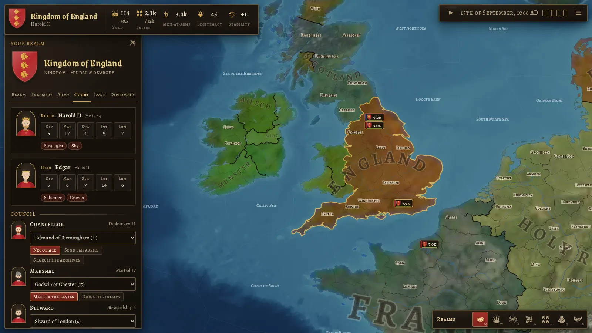

# Crowns & Centuries

A grand strategy game in the spirit of Crusader Kings, played in the browser on a map of the whole
world. You rule a **country**, not a dynasty: pick any of the 188 realms of 15 September 1066, and
(in later milestones) guide it through a thousand years of war, diplomacy, faith and invention until
1 January 2066.

**Play in the browser:** https://danyalkhan95.github.io/Crusader-Kings-Clone/ (GitHub Pages, rebuilt on
every push).


## Status

**Milestone 4: religion and culture.** Faith and people now matter within the realm and between
realms. Every other realm is run by the AI.

- **Other faiths and peoples:** provinces of a sister faith, of unbelievers, or of a kindred or
  foreign people pay and serve less, and stir up the commons. Accept a great people of the realm
  as your own (one culture for a duchy, up to three for an empire).
- **Missions and schools:** the court chaplain sends missionaries and the steward founds schools,
  one province at a time; peoples also drift towards their rulers' ways.
- **Religious policy:** a new law, from persecution (fast conversion, a happy clergy, angry
  unbelievers) to tolerance (the reverse).
- **Heads of faith:** the Pope, the Ecumenical Patriarch and the Caliphs. The faithful think well
  of them, and a donation buys a blessing on your reign.
- **Holy places:** Jerusalem, Rome, Mecca, Varanasi and others. Holding those of your faith adds
  legitimacy; unbelievers who hold them are resented.
- **Holy wars:** Christian and Muslim realms may fight unbelievers for a province on their border
  or a holy place, at half the usual price in war score.
- **Crusades and jihads:** once in a generation the head of the faith calls every realm of the
  faith to free Jerusalem, and the other faith rallies to its defence. A crusade that wins founds
  the Kingdom of Jerusalem, settled by the crusaders who got there.
- **Heresies and schisms:** Bogomils, Cathars, Waldensians, Lollards, Hussites, Druze and Nizaris
  rise in their homelands in their time, and a crown whose people have turned may break with the
  old church. Pagan crowns may take up the faith of a strong neighbour.
- **Screens:** a Faith tab for your realm, faith and culture in the province panel with the
  missions, and the faith map (`Y`) with its legend.


Earlier milestones:

- **Internal politics (M3):** laws of succession, crown authority, conscription and taxation;
  legitimacy; estates with power, loyalty and privileges; revolts and pretenders; factions of
  vassals; elective, republican and theocratic successions; council tasks; governments;
  procedural portraits.
- **Diplomacy (M2):** opinion with its reasons; alliances, non-aggression pacts, military access
  and guarantees; calls to arms; forged claims; aggressive expansion and coalitions; vassal
  loyalty, integration and tributaries; the diplomacy map (`U`).
- **The first playable (M1):** time with five speeds; an economy of taxes, levies, buildings and
  loans; armies of levies and men-at-arms, battles, sieges and war score; peace deals and
  truces; AI; saves; Hardrada and William in 1066.
- **The world of 1066 (M0):** 3,000 provinces, 498 sea zones and 35 great lakes on hillshaded
  terrain; 188 realms with rulers, lieges and coats of arms; map modes for realms, countries,
  terrain, development, culture and faith.



Next up is **Milestone 5: technology and eras**, carrying the world from knights and manors to
rifles and factories. The full plan is in [docs/ROADMAP.md](docs/ROADMAP.md).

## Controls

| Action            | Mouse / touch                            | Keys                        |
| ----------------- | ---------------------------------------- | --------------------------- |
| Pan               | drag                                     | arrow keys                  |
| Zoom              | wheel, pinch, double-click               | `+` / `-`                   |
| Inspect, treat    | click a province, army or coat of arms   |                             |
| March             | select an army, then right-click a place |                             |
| Pause, speed      | buttons at the top right                 | `Space`, `1`–`5`            |
| Map modes         | buttons at the bottom right              | `Q` `W` `E` `R` `T` `Y` `U` |
| Close panel, menu |                                          | `Esc`                       |

## Running it

```sh
npm install
npm run dev        # http://localhost:5173
npm run build      # static site in dist/, works from any folder or host
```

Checks:

```sh
npm run typecheck && npm run lint && npm test
npm run e2e        # Playwright smoke test (builds and serves the site itself)
npm run mapgen:validate
npm run simulate -- --years 50   # the whole world under AI, headless, with a summary
```

The generated map lives in `public/data` and is committed, so none of the above needs the map
pipeline.

## The map pipeline

`tools/mapgen` builds `public/data` from open data:

1. Rasterise the source data onto a 16384×8192 Miller projection.
2. Merge and split modern admin regions into about 3,000 provinces, weighted by population and
   terrain.
3. Grow the sea zones.
4. Vectorise all borders into shared, smoothed arcs.
5. Classify terrain and development, and name everything.
6. Assign the 1066 realms.
7. Render the terrain tiles.

```sh
npm run mapgen:download   # sources into .cache/ (about 1 GB)
npm run mapgen            # all steps (needs about 12 GB of memory, about 10 minutes)
npm run mapgen -- scenario export        # or just some steps
npm run mapgen:validate
```

Hand-curated tables live in `tools/mapgen/curated`:

- realms of 1066, with rulers and overrides
- cultures and faiths
- historical city names
- terrain zones
- sea names

## Project layout

| Path             | What                                                                             |
| ---------------- | -------------------------------------------------------------------------------- |
| `src/render/`    | WebGL2 map: terrain, fills, borders, rivers, labels, picking, camera             |
| `src/sim/`       | The simulation: economy, characters, armies, war, diplomacy, politics, faith, AI |
| `src/game/`      | Loading the world, and map modes                                                 |
| `src/heraldry/`  | Coats of arms: blazon model, curated arms, generator, SVG                        |
| `src/ui/`        | React screens, HUD and era themes                                                |
| `src/shared/`    | Code used by both the game and the pipeline (map format, projection, types)      |
| `tools/`         | Map pipeline, icon extraction, artifact packaging                                |
| `tests/`, `e2e/` | Vitest unit tests and Playwright end-to-end tests                                |

## Credits and licences

Crowns & Centuries is free software under the **GNU General Public License v3.0**; see
[LICENSE](LICENSE). It builds on:

| What                                       | Source                                                                                                            | Licence                         |
| ------------------------------------------ | ----------------------------------------------------------------------------------------------------------------- | ------------------------------- |
| Coastlines, rivers, lakes, regions, places | [Natural Earth](https://www.naturalearthdata.com/)                                                                | Public domain                   |
| Borders of the world around 1066           | [Historical Basemaps](https://github.com/aourednik/historical-basemaps), André Ourednik et al.                    | GPL-3.0                         |
| Elevation and sea depth                    | [Terrain Tiles on AWS](https://registry.opendata.aws/terrain-tiles/) (Mapzen; SRTM, GMTED2010, ETOPO1 and others) | Open data, attribution required |
| Colours of the land                        | [NASA Blue Marble](https://visibleearth.nasa.gov/collection/1484/blue-marble), NASA Earth Observatory             | Public domain                   |
| Heraldic charges and icons                 | [game-icons.net](https://game-icons.net/), Lorc, Delapouite and contributors                                      | CC BY 3.0                       |
| Typefaces                                  | Grenze Gotisch (Omnibus-Type), Alegreya and Alegreya SC (Huerta Tipográfica), via Fontsource                      | SIL OFL 1.1                     |

Crusader Kings is a trademark of Paradox Interactive. This project is a fan-made homage and is
not affiliated with or endorsed by Paradox.
