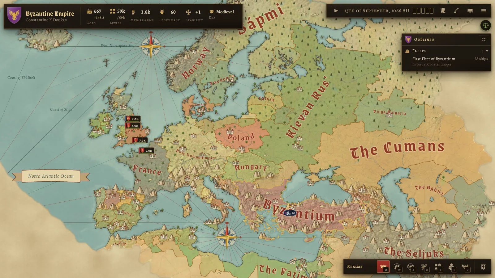
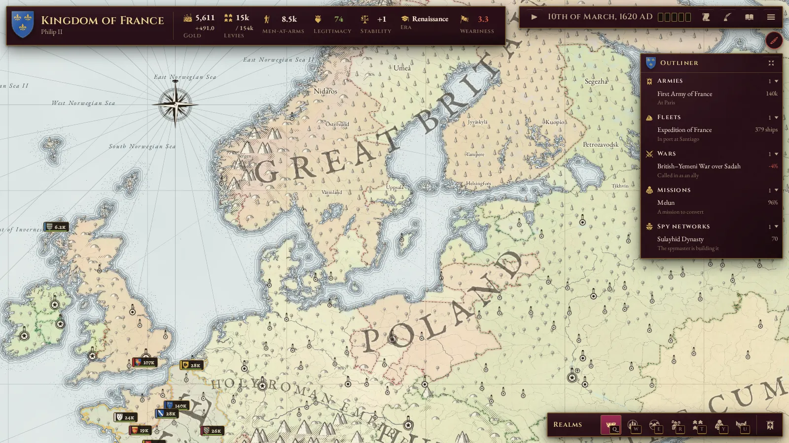

# Crowns & Centuries

A grand strategy game in the spirit of Crusader Kings, played in the browser on a map of the whole
world. You rule a **country**, not a dynasty: pick any of the 188 realms of 15 September 1066, and
guide it through a thousand years of war, diplomacy, faith and invention until 1 January 2066.

**Play in the browser:** https://danyalkhan95.github.io/Crusader-Kings-Clone/ (GitHub Pages, rebuilt on
every push).


## Status

**Milestone 12: the map through the ages.** The game can be played from 1066 to 2066 and beyond,
every other realm run by the AI, and it is on the road to Early Access as a desktop app (milestones
9 to 18 in the [roadmap](docs/ROADMAP.md)). This milestone brought:

- **Three maps for three ages,** following the player's era or pinned in the settings: a
  manuscript on parchment with painted hills and forests, walled towns, gilt borders and the rhumb
  lines of the portolan charts; an engraved atlas with hachured relief, water-lined seas, a
  graticule, compass roses and cartouches; and a modern map of political colours over shaded
  relief. A new era fades the old map into the new.
- **Symbols on the land:** some 27,000 mountains, hills and forests placed from the elevation and
  the forest cover, and a town in each province that grows with it, crowned in the capitals of
  kings and marked with its faith's sign where it is holy.
- **Names in the hands of each age, and of their time:** realm names rubricated on the manuscript
  and in copperplate capitals on the atlas; Constantinople becomes Istanbul under the Turks and
  Königsberg is Kaliningrad only after 1946; 517 provinces once named after modern admin regions
  take period names ("North-West Aktobe" is now the Ilek).





Earlier milestones:

- **Realm screens and learning the game (M11):** full screens for the realm's affairs over the map;
  an encyclopedia (`B`) of every rule and the game's data, linked from tooltips; counsel from the
  council, and hints the first time something comes up.
- **The new HUD (M10):** an outliner of armies, fleets, sieges, wars and works; an alerts bar that
  leads to the fix; a message log with filters and a setting for each kind of news; menus on a
  right-click; hotkeys for everything; layers for whose armies and fleets the map shows.
- **Foundations for a release (M9):** a desktop app for Windows, macOS and Linux; settings for the
  interface, graphics, speed and every key; named saves, autosaves and ironman; an error screen
  that keeps the game; a performance budget; a pipeline for art and checked content for mods.
- **The endgame and polish (M8):** the standing of nations and the end of the age in 2066; the
  ledger of nations (`L`) with a chronicle of the thousand years; balance from headless runs of a
  thousand years; How to play (`H`), a guided tour of the first campaign, and sound made on the fly
  with Web Audio.


- **Events, decisions and espionage (M7):** some 35 events across the eras, each a choice with
  its costs shown; the Black Death and later pestilences; Halley's comet, the Horde, the
  Reformation, the Crash and world wars; nations to proclaim; spy networks and plots.
- **Navies, exploration and colonisation (M6):** warships by era, sea battles and blockades;
  transports for armies at sea; terra incognita, expeditions and shared maps; colonies and
  colonial nations.
- **Technology and eras (M5):** three tracks of 33 levels over six eras, each level with its
  year in history; arms, buildings and governments that modernise; nationalism and ideologies;
  era themes, banners and national flags.
- **Religion and culture (M4):** other faiths and peoples within the realm; missions, schools and
  accepted cultures; religious policy; heads of faith and holy places; holy wars, crusades and
  jihads, and the Kingdom of Jerusalem; heresies and schisms; the faith map (`Y`).
- **Internal politics (M3):** laws of succession, crown authority, conscription and taxation;
  legitimacy; estates with power, loyalty and privileges; revolts and pretenders; factions of
  vassals; elective, republican and theocratic successions; council tasks; governments;
  procedural portraits.
- **Diplomacy (M2):** opinion with its reasons; alliances, non-aggression pacts, military access
  and guarantees; calls to arms; forged claims; aggressive expansion and coalitions; vassal
  loyalty, integration and tributaries; the diplomacy map (`U`).
- **The first playable (M1):** time with five speeds; an economy of taxes, levies, buildings and
  loans; armies of levies and men-at-arms, battles, sieges and war score; peace deals and
  truces; AI; saves; Hardrada and William in 1066.
- **The world of 1066 (M0):** 3,000 provinces, 498 sea zones and 35 great lakes on hillshaded
  terrain; 188 realms with rulers, lieges and coats of arms; map modes for realms, countries,
  terrain, development, culture and faith.


The plan, what each milestone brought and the known gaps are in [docs/ROADMAP.md](docs/ROADMAP.md).

## Controls

| Action            | Mouse / touch                            | Keys                        |
| ----------------- | ---------------------------------------- | --------------------------- |
| Pan               | drag                                     | arrow keys                  |
| Zoom              | wheel, pinch, double-click               | `+` / `-`                   |
| Inspect, treat    | click a province, army or coat of arms   |                             |
| What to do there  | right-click a place, or hold a finger    |                             |
| March             | select an army, then right-click a place |                             |
| Sail              | select a fleet, then right-click a sea   |                             |
| Pause, speed      | buttons at the top right                 | `Space`, `1`–`5`            |
| Map modes         | buttons at the bottom right              | `Q` `W` `E` `R` `T` `Y` `U` |
| Armies shown      | the banner after the map modes           |                             |
| Your realm        | coat of arms at the top left             | `I` `C` `G` `A` `D` `F` `J` |
| Technology        | the era at the top                       | `K`                         |
| Encyclopedia      | book at the top right                    | `B`                         |
| Ledger of nations | scroll at the top right                  | `L`                         |
| Log of news       | quill at the top right                   | `N`                         |
| Outliner          | on the right                             | `O`                         |
| Capital           |                                          | `Home`                      |
| Next army, fleet  | the outliner                             | `Z`, `X` (`Shift`: back)    |
| How to play       | game menu                                | `H`                         |
| Performance       | settings                                 | `F3`                        |
| Close panel, menu |                                          | `Esc`                       |
| Fullscreen (app)  | settings                                 | `F11`, `Alt+Enter`          |

Every key can be changed in the settings.

## Running it

```sh
npm install
npm run dev        # http://localhost:5173
npm run build      # static site in dist/, works from any folder or host
npm run build:demo # the free web demo: the world stops a century on, and it ships no art
```

Checks:

```sh
npm run typecheck && npm run lint && npm test
npm run e2e        # Playwright smoke test (builds and serves the site itself)
npm run mapgen:validate
npm run simulate -- --years 50   # the whole world under AI, headless, with a summary
npm run daycost -- --load save.json   # the performance budget's measure (see M9 in the roadmap)
```

The generated map lives in `public/data` and is committed, so none of the above needs the map
pipeline.

### The desktop app

The same game as an app for Windows, macOS and Linux, built with Electron. It keeps saves and
settings as files in `Documents/Crowns & Centuries`, saves the campaign when its window closes, and
plays in a window or fullscreen (`F11` or `Alt+Enter`, or the settings).

```sh
npm run app        # build, then start the app
npm run app:dist   # build, then package it for this system into release/
xvfb-run -a npx playwright test --project desktop   # its end-to-end test (on Linux, with Xvfb)
```

Unsigned test builds for all three systems come from the **Desktop app** workflow: on `main`, on
version tags, or run by hand from the Actions tab.

## The map pipeline

`tools/mapgen` builds `public/data` from open data:

1. Rasterise the source data onto a 16384×8192 Miller projection.
2. Merge and split modern admin regions into about 3,000 provinces, weighted by population and
   terrain.
3. Grow the sea zones.
4. Vectorise all borders into shared, smoothed arcs.
5. Classify terrain and development, and name everything.
6. Assign the 1066 realms.
7. Render the terrain tiles.
8. Draw the details the map's styles need: hillshade, steepness and the distance from the coast,
   and place the mountains, forests and towns.

```sh
npm run mapgen:download   # sources into .cache/ (about 1 GB)
npm run mapgen            # all steps (needs about 12 GB of memory, about 10 minutes)
npm run mapgen -- scenario export        # or just some steps
npm run mapgen:validate
npm run mapgen:names      # period names for provinces named after modern admin regions
```

Hand-curated tables live in `tools/mapgen/curated`:

- realms of 1066, with rulers and overrides
- cultures and faiths
- historical city names
- terrain zones
- sea names
- period names chosen by hand

## Project layout

| Path             | What                                                                             |
| ---------------- | -------------------------------------------------------------------------------- |
| `src/render/`    | WebGL2 map in three styles: terrain, fills, borders, symbols, labels, picking    |
| `src/sim/`       | The simulation: economy, war, diplomacy, politics, faith, technology, events, AI |
| `src/game/`      | Loading the world, and map modes                                                 |
| `src/heraldry/`  | Coats of arms: blazon model, curated arms, generator, SVG                        |
| `src/ui/`        | React screens, HUD and era themes                                                |
| `src/shared/`    | Code used by both the game and the pipeline (map format, projection, types)      |
| `src/content/`   | Content as checked data files (featured realms, modifiers), ready for mods       |
| `electron/`      | The desktop app: Electron's main process, the bridge to the game, the app icon   |
| `tools/`         | Map pipeline, icons, art assets, artifact packaging                              |
| `tests/`, `e2e/` | Vitest unit tests and Playwright end-to-end tests                                |

## Credits and licences

Crowns & Centuries is free software under the **GNU General Public License v3.0**; see
[LICENSE](LICENSE). It builds on:

| What                                       | Source                                                                                                                   | Licence                         |
| ------------------------------------------ | ------------------------------------------------------------------------------------------------------------------------ | ------------------------------- |
| Coastlines, rivers, lakes, regions, places | [Natural Earth](https://www.naturalearthdata.com/)                                                                       | Public domain                   |
| Borders of the world around 1066           | [Historical Basemaps](https://github.com/aourednik/historical-basemaps), André Ourednik et al.                           | GPL-3.0                         |
| Elevation and sea depth                    | [Terrain Tiles on AWS](https://registry.opendata.aws/terrain-tiles/) (Mapzen; SRTM, GMTED2010, ETOPO1 and others)        | Open data, attribution required |
| Colours of the land                        | [NASA Blue Marble](https://visibleearth.nasa.gov/collection/1484/blue-marble), NASA Earth Observatory                    | Public domain                   |
| Heraldic charges and icons                 | [game-icons.net](https://game-icons.net/), Lorc, Delapouite and contributors                                             | CC BY 3.0                       |
| Typefaces                                  | Grenze Gotisch (Omnibus-Type), Alegreya and Alegreya SC (Huerta Tipográfica), via Fontsource                             | SIL OFL 1.1                     |
| Typefaces of the later eras                | Cinzel, EB Garamond, IM Fell English, Playfair Display, Old Standard TT, Oswald, Source Sans 3 and Inter, via Fontsource | SIL OFL 1.1                     |

Crusader Kings is a trademark of Paradox Interactive. This project is a fan-made homage and is
not affiliated with or endorsed by Paradox.
